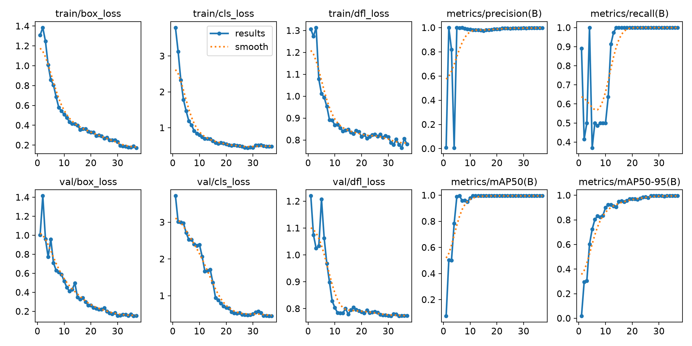
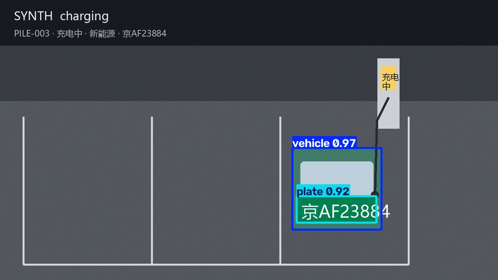
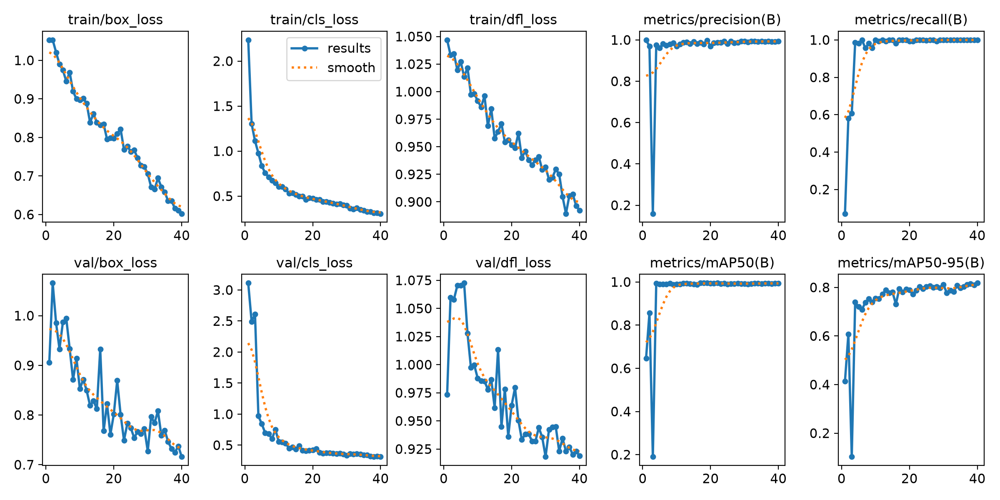
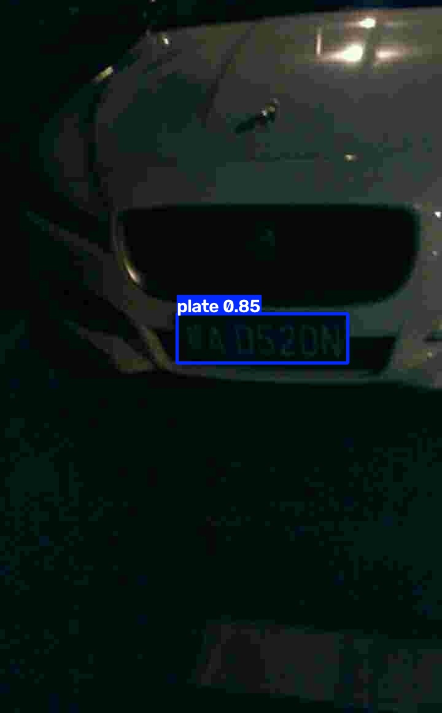

# CV 产物凭据（第 2 周任务 5.1）

> **为什么会有这个目录**：第 1 周审查留下的**唯一真风险**是「CV 产物没有仓库内凭据」——
> `algo/dataset` 与 `algo/runs` 都被 `.gitignore` 忽略，本机也不存在，
> 于是「数据集生成 / 训练 / 推理」这三件事**无法证明真的跑过**（第 1 周 R1）。
> 本目录把复跑的**日志与截图**存进仓库，让 M1–M3 可以从仓库里直接验收。

**复跑时间** 2026-10-05　**执行人** 汤瑾睿　**机器** NVIDIA GeForce RTX 4060 Laptop GPU（CUDA 可用）

## 一、复跑步骤（可复现）

在仓库根目录执行（用算法环境 `.venv-algo`，不是后端 `.venv`）：

```bat
.venv-algo\Scripts\python.exe algo\tools\check_env.py           > docs\acceptance\algo\00-check-env.log 2>&1
.venv-algo\Scripts\python.exe algo\tools\gen_synth_dataset.py   > docs\acceptance\algo\01-gen-dataset.log 2>&1
.venv-algo\Scripts\python.exe algo\train\detect.py train --epochs 40 > docs\acceptance\algo\02-train.log 2>&1
.venv-algo\Scripts\python.exe algo\train\detect.py predict       > docs\acceptance\algo\03-predict.log 2>&1
```

> ⚠️ **踩坑**：`train` 会去 GitHub 下载预训练权重 `yolov8n.pt`（约 6.5 MB），
> 本机代理下 ultralytics 的下载器会 `502` 失败（日志里能看到 3 次重试）。
> 解决办法是**先用系统代理把权重下到 `algo/weights/yolov8n.pt`**（该目录已被忽略，不入库）：
> ```powershell
> Invoke-WebRequest -Uri "https://github.com/ultralytics/assets/releases/download/v8.4.0/yolov8n.pt" `
>   -Proxy "http://127.0.0.1:7897" -OutFile "algo\weights\yolov8n.pt"
> ```
> 有本地权重后 `YOLO(...)` 不会再触发联网下载。

## 二、结果

| 环节 | 证据 | 结论 |
|---|---|---|
| 环境自检 | `00-check-env.log` | **7/7 PASS**：Python 3.11.9 / torch 2.6.0+cu124 / CUDA 可用（RTX 4060）/ ultralytics 8.4.155 / hyperlpr3 0.1.3 |
| 数据集生成 | `01-gen-dataset.log` | 132 张（train 109 / val 23），2 类 `vehicle` / `plate` |
| 训练 | `02-train.log`、`results.png` | 40 epoch 预算、epoch 27 早停，**mAP50 = 0.995 / mAP50-95 = 0.995**，P=0.997 R=1.0 |
| 推理验证 | `03-predict.log`、`charging_006_pred.jpg` | val 集 `charging_006.jpg` 同时检出车辆（conf 0.973）与车牌（conf 0.923），框位正确 |





## 三、真实数据集上的结果（任务 5.3–5.5，**这才是能对外报的数**）

第 1 周那个 mAP50=0.995 是**合成集**上的，只能证明链路跑通。第 2 周改用公开真实
数据集 **CCPD**（停车场车头照）后，重新训练并评估如下。

### 3.1 数据集（`algo/dataset_real/`，不入库）

| 来源 | 牌色 | 张数 |
|---|---|---|
| CCPD2020（绿牌） | 新能源 | 400 |
| CCPD2019 子集 | 燃油为主 | 400 |
| **合计** | 绿 419 / 蓝 381 | **800**（train 640 / val 160） |

只标 **`plate` 单类**：CCPD 只有车牌框、**没有车辆框**，混进两类的合成集会把
`vehicle` 类教坏（真实图上的车会被当成背景）。`vehicle` 仍由合成集负责。

### 3.2 训练（`04-train-real.log`、`results_real.png`）

40 epoch（未早停，5 分 10 秒，RTX 4060）：**P=0.994 / R=0.999 / mAP50=0.994 / mAP50-95=0.821**



### 3.3 端到端评估（`05-eval-real.json`，val 160 张）

| 环节 | 指标 | 结果 |
|---|---|---|
| 检测 | 检出率 / IoU≥0.5 命中率 / 平均 IoU | **100% / 100% / 0.9005** |
| OCR | 整串完全匹配 / 字符级 | **91.25% / 96.82%** |
| 牌色 | 绿蓝判定正确率 | **95.00%** |
| 端到端 | 号码正确 / 号码+牌色全对 | **91.25% / 88.75%** |

分牌色拆解（**蓝牌明显更难**，答辩要如实讲）：

| 牌色 | 样本 | OCR 整串 | 牌色判定 |
|---|---|---|---|
| 新能源（绿） | 86 | **96.51%** | **100%** |
| 燃油（蓝） | 74 | **85.14%** | **89.19%** |

剩余 14 张失败集中在：省份汉字认错（皖→粤/宁/京 是主要错误模式）与少量空值。
蓝牌字符更小、反光更强，是后续优化的主要方向。



### 3.4 ⚠️ 修掉的一个静默 bug：OCR 此前从来没工作过

真实集评估第一次跑出来 OCR 整串匹配 **0.00%**（160 张一张都没认出），
排查后发现是解析顺序错了：

- hyperlpr3 3.x 实际返回 `[号码, 置信度, 牌色, 框]`
- 而 `ocr_plate` 按 `(框, 号码, 置信度, 牌色)` 解析 → **拿置信度当号码、牌色当置信度**
  → 车牌正则必然不过 → OCR **静默恒定返回空串**

**为什么第 1 周没发现**：合成牌本来就识别不出号码（验收时把"plate 为空"当作正常），
所以这个 bug 在合成集上完全不可见。教训是**第三方库返回结构必须打印实测一次再写解析**。

修复后同一批数据从 0.00% → 91.25%。已加防回归测试
（`test_ocr_plate_parses_hyperlpr3_order`），把字段顺序钉死。

### 3.5 OCR 该喂裁剪 ROI 还是整帧？（实测结论：整帧）

| OCR 输入 | 整串匹配 | 字符级 | 蓝牌 |
|---|---|---|---|
| 裁剪 ROI | 82.50% | 89.42% | 68.92% |
| 整帧 | 91.25% | 96.82% | 85.14% |
| 整帧+按检测框挑（**线上采用**） | **91.25%** | **98.12%** | **85.14%** |

HyperLPR3 自带检测器，喂整帧比喂一块裁好的小图更准（裁剪丢掉边缘上下文，蓝牌掉 16pp）。
但整帧"取最高分"在多车场景会认成隔壁车的牌，故线上按 **IoU 挑最贴合检测框**的那条
——准确率持平且不会串号（串号=短信发错人）。

## 四、⚠️ 局限（答辩须如实说明）

- 训练与验证用的是**公开真实集（CCPD）**，不是校园实拍。CCPD 是停车场车头照，
  **没有充电桩与充电枪**，因此「是否插枪 / 桩状态」这类场景特征仍需校园实拍补充。
- 蓝牌 OCR（85.14%）与蓝牌牌色判定（89.19%）偏低，是已知短板。
- 合成集上的 mAP50=0.995 只说明「链路跑通」，**不要**拿它当真实准确率。

## 五、产物位置（均不入库，`.gitignore` 已忽略）

| 产物 | 路径 |
|---|---|
| 合成数据集 | `algo/dataset/`（images / labels / data.yaml / meta.json） |
| 真实数据集 | `algo/dataset_real/`（800 张，CCPD 转换产出） |
| 合成集权重 | `algo/runs/detect/train/weights/best.pt`（6.2 MB） |
| **真实集权重** | `algo/runs/detect/train_real/weights/best.pt`（6.2 MB） |
| 预训练权重 | `algo/weights/yolov8n.pt`（6.5 MB，需自行下载，见上文踩坑） |
| 原始压缩包 | `algo/dataset_raw/`（CCPD2020 865 MB + CCPD2019 子集 1.5 GB） |

## 六、复跑真实集链路（可复现）

```bat
.venv-algo\Scripts\python.exe algo\tools\fetch_public_dataset.py           :: 下载 CCPD
.venv-algo\Scripts\python.exe algo\tools\ccpd_to_yolo.py --zip algo\dataset_raw\ccpd2020-green.zip --max 400 --prefix real --clean
.venv-algo\Scripts\python.exe algo\tools\ccpd_to_yolo.py --zip algo\dataset_raw\ccpd2019-subset.zip --max 400 --prefix blue
.venv-algo\Scripts\python.exe algo\train\detect.py train --data algo\dataset_real\data.yaml --name train_real --epochs 40
.venv-algo\Scripts\python.exe algo\tools\eval_real.py --split val --weights algo\runs\detect\train_real\weights\best.pt
```

> 踩坑：CCPD2019 子集用**逗号**分隔坐标（`302,471_372,497`），CCPD2020 用 `&`，两种都要认；
> 另解压 1.5 GB 的包要十几分钟（脚本已做"已解压则复用"）。
